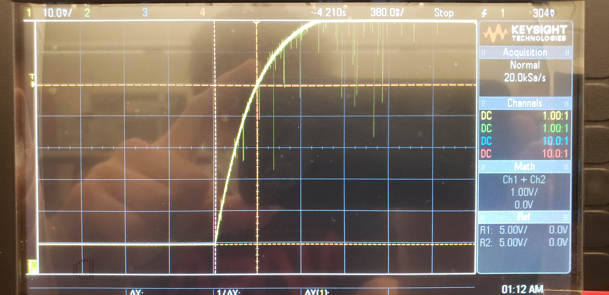

# ME405Lab4

Program by Luke Sandsor, Jack Barone, Jackson Meyers

## Discussion

Our RC circuit used a 100kΩ resistor and a 3.3µF capacitor. This creates an RC circuit with a theoretical time constant of 0.33s.
We connected the input of this circuit to the C0 pin on the Nucleo and the output to the C1 pin.
Then we wrote a short program to initialize the pins and ADC, then read the values from the ADC in an ISR and output to the serial monitor.
Running the program, we measured the time constant using the oscilloscope.

## Results

The time constant as measured on the oscilloscope was 365ms or 0.365s. This is a 10.6% difference from the expected value, so it is within typical
electronics tolerances.

#### Oscilloscope Measurement

Next, we measured the time constant again using the serial data from the Queue. Based on the plot, we determined the time constant to be about 0.348s.
This is also within the expected tolerances. Overall, the time constants we measured were accurate to our expected results and the interrupt service routine we wrote correctly gathered the data at fixed intervals.

#### Plotted Results
